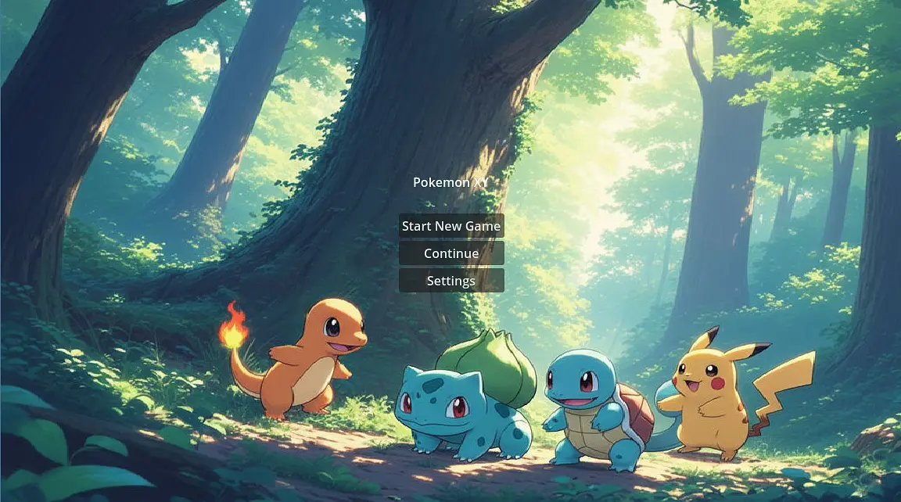

#  Pokemon DustGrey - 190 Hour Alpha V0.10 Edition

A recreation of the classic pokemon games built ground up with GODOT 4.5 and c# wituh heartgold visuals.

## Whats going on after the 100 hours?


##  Features & New Content

- **Modular Battle System:** A C# driven combat engine featuring level-scaling and move logic.
- **Reactive Story NPCs:** Advanced NPC logic using an Event-State Machine for path-blocking and forced interceptions (e.g., Prof. Oak and Giovanni).
- **Custom Pixel Art:** Includes hand-drawn sprites for Gym Leaders like Brock.
- **Save/Load Persistence:** Integrated system to track badges and player progress.

##  World Map Progress

- **Pallet Town:** Home base featuring Delia (First npc) and Prof. Oak (Starter/Blocker).
- **Viridian City:** Featuring the high-stakes early encounter with Giovanni.
- **Pewter City:** Fully mapped Gym with a functional Brock boss fight.
- **Lavender Town:** Foundations and map layout implemented (Access restricted in Alpha).
- **Route Connectivity:** 4 fully playable routes with active NPC interaction.
- **Visual Revamp** I started doing a visual revamp of the whole map! Im moving to heart gold assets cause they look more mordern!

##  Updated Roadmap

### **Phase 1: Core Engine (COMPLETE)**
- [x] Custom C# Logger
- [x] Grid-Based Movement & Snapping
- [x] Signal-Based Animation System

### **Phase 2: World & Interaction (COMPLETE)**
- [x] Dialogue System & Save Manager
- [x] Story-State NPC Logic (Path Blocking)
- [x] Gym Leader Boss AI

### **Phase 3: Expansion (NEXT STEPS)**
- [x] Full Level Script.
- [x] Inventory
- [ ] Item usage

##  Project Structure

```
addons/
|── MoveImporter/           # The tool to import a specific amount of pokemon moves
├── pokemon_importer/       # Imports all the pokemon and their sprites
├── item_importer/          #  Pokeball Importer!
├── item_importer/          # Normal Items Importer
scripts/
├── core/           # Singletons (Globals, Logger)
├── gameplay/       # Movement, Input, Animation logic
├── utilities/      # State Machines, Math helpers
├── ui/             # Tailwind-integrated UI components
assets/
├── sprites/        # Character and NPC sheets
└── tilesets/       # Environment textures and collisions
└── audio/          # All the music for the game!
└── fonts/          # Text fonts!
└── items/          # item images!
└── fonts/          # pokemon sprites!
└── ui/             # Images for all the ui!


```
## Installation Instructions:
- Download the zip file from the newest git release.
- Unzip the contents into a folder
- Double click the exe file
- anddd youre ready to go!
## Demo gameplay

**Controls**
- Movement: WASD keys
- Menu - press 'm', arrow keys to navigate, z to select and c to go back
- Doing battles and quing messages - space(stuff like npcs, signs,more to come).

Steps to Play
 - Go to the first floor of the house and talk to mom.
 - navigate to the pokemon lab and meet proffeser oak to get your first pokemon.
- then you can go exploring. More depth and lore will come in later updates. This release is meant to establish the base structure of the running game. The expansions will include an option to play the game in 3d and I will also be adding all of the regions one by one. Hope you like it !!
- After this head to route 1. Here youll find some battelable npcs! Then you can also go to viridian city!
- Demo video - [(https://drive.google.com/file/d/1_hluYmmO07SBG4c6u8KExGsz6OPXV322/view?usp=sharing)]
## Acknowledgements

- [Engine](https://godotengine.org/)
- Inspiration: Pokémon X/Y (Nintendo/GameFreak)
- Tutorial Foundations: Inspired by The Nerdy Canuck's Pokémon Clone series.
- Player and npc - https://www.deviantart.com/aveontrainer
- Tileset = https://www.deviantart.com/flurmimon/gallery/75279275/pokemon-rhin-concept
- Other assets - https://www.spriters-resource.com
- Brok sprite - JoshR691
